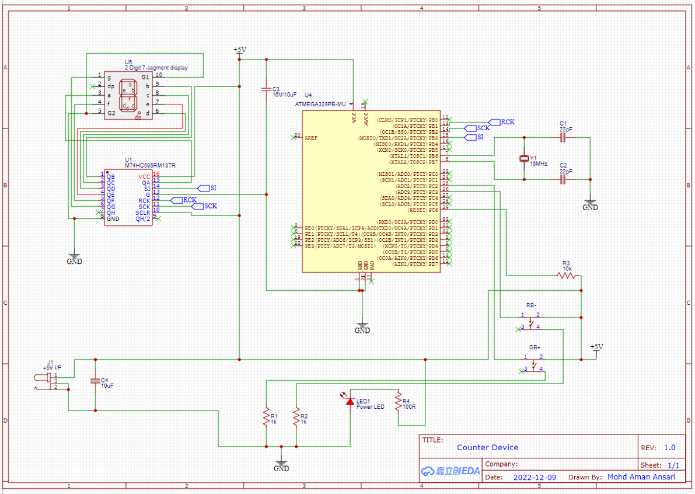
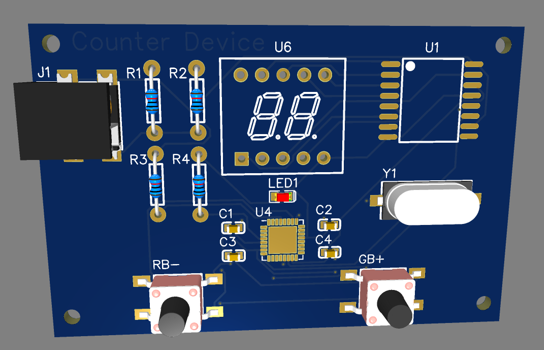
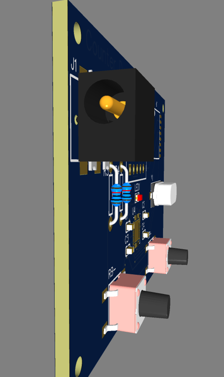

# Covid-19 Person Counter Device

  The emergence and spread of COVID-19 across the world have caused much distress and panic. One of the most effective ways to slow the spread of the virus is by ensuring social distancing is followed. Maintaining social distance in indoor venues is particularly important because occupants can be susceptible for airborne infection owing to limited ventilation. A preliminary way to ensure social distancing is maintained inside indoor venues like a room, restaurant, party hall etc. is to ensure that the spatial capacity of the venue is never exceeded.

# Criteria

  The device is ideally mounted at the entrance of the room. The device has two push buttons indicated in Green and Red. It has a 2-digit 7 segment display to indicate the count. Guests press the green push button as they walk inside the venue and accordingly the count on the display increments by 1 with every press. While exiting the guests press the red button and accordingly the count on the display decrements by 1. The simple solution helps inform guests about the occupancy and they can choose not to enter if the occupancy is near or above the spatial capacity of the venue.

### Schematic

### PCB Layout

### 2D view

### 3D view

